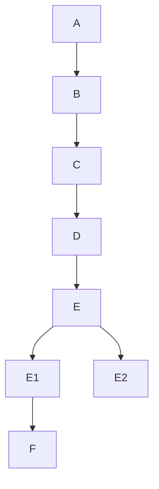

# Hindustani-Classical-Raga-Identification

This project focuses on identification and classification of hindustani classical ragas using Machine Learning techniques. We are using 2D CNN as our machine learning model to train our
audio feature dataset. The audio feature that will be used in this project is MFCC.
The Mel-Frequency Cepstral Coefficients (MFCCs) will be extracted from various audio recordings, which has been used to train and evaluate CNN to accurately identify and distinguish between different ragas.
MFCCs are highly effective in representing the timbral and spectral characteristics of sound. It emphasizes the parts of the audio signal that are most relevant for understanding human language, while filtering out less important information like background noise or pitch variations. Therefore, MFCC features represents a compact and effective way to represent sound that mimics how humans perceive speech
The goal is to develop a robust system for raga recognition, which has its potential applications in music information retrieval, music education, and cultural preservation.

In the initial phase we are taregting on some of the base Ragas to develop our CNN model.
- Asavari
- Bageshree
- Bhairava
- Bhairavi
- Bhoopali
- Darbari
- Malkauns
- Sarang
- Yaman

## Model Description
This project comprises model structure based on Mel spectogram characteristics.We extract the spectrogram characterictics for each audio signals and create a dataset and then create a csv file.
We then preprocess our dataset using the CSV file with MFCC coefficients and split into training and validation dataset to train our 2D CNN model.
This project further extends to a third structure with the addition of some audio augmented features with the existing MFCC coefficient to compare the performance of our CNN model with the MFCC model.

## Project Workflow



```mermaid
graph TD;
    A-->B;
    B-->C;
    C-->D;
    D[Dataset Preparation:Save Features(MFCCs) & Targets(Ragas)]-->E;
    E{Data Splitting:Split Dataset}-->E1[Training Set(80%)];
    E-->E2[Validation Set(10%)];
    E1-->F;
    A[Data Collection:Audio Recordings(.wav, .mp3)];
    B[Audio Preprocessing:Read Audio(librosa)];
    C[Feature Extraction:Extract MFCCs];
    subgraph CNN Model Architecture
        F[Model Architecture (CNN): Input Layer]-->F1(Conv2D Layers);
        F1-->F2(MaxPooling2D Layers);
        F2-->F3(Dropout Layers);
        F3-->F4(Flatten Layer);
        F4-->F5(Dense Layers);
        F5-->F6[Output Layer: Dense + Softmax];
    end
    F6-->G;
    G[Model Training:Compile (Adam, Categorical Crossentropy, Metrics)]-->H;
    H[Model Training:Fit Model (Training Data) & Monitor (Validation Data)]-->I(Classification Model);
```

## Project Description
1. Data Collection: Collect the audio recordings (.wav, .mp3) of the Hindustani classical ragas for classification.
2. Audio Preprocessing: Read the audio files using librosa and converts a list of variable-length feature sequences into a uniform, zero-padded Pandas DataFrame, making it suitable for machine learning inputs.
3. Feature Extraction: For each audio segment, extracts MFCCs along with their first (delta) and second (delta-delta) derivatives from an audio file, then computes their mean over time to produce a single, representative feature vector.This converts the complex audio signal into a 2D representation.
4. Dataset Preparation: Saving the extracted MFCCs (the features) and their corresponding raga labels (the targets) as csv file for easy loading during training.
5. Data Splitting: The complete dataset has been divided into Training Set (e.g., 80%) for training the CNN model and Validation Set (e.g., 10%) to monitor training progress, tune hyperparameters, and prevent overfitting.
6. Model Architecture(CNN): In this project, we created a Convolutional Neural Network (CNN) architecture.MaxPooling2D layers (to reduce dimensionality).Dropout layers (to prevent overfitting).A Flatten layer (to transition from 2D feature maps to a 1D vector).Dense (fully connected) layers for classification.A final Dense output layer with a softmax activation function to output a probability for each raga class.
7. Model Training: The model has been compiled using Adam optimizer, a loss function (categorical_crossentropy), and evaluation metrics.The model has been trained by "fitting" it to the training dataset, using the validation set to check for improvement after each epoch.

## Model Performance: Confusion Matrix

This confusion matrix visualizes the performance of our Raga classification model, which was trained using MFCC (Mel-Frequency Cepstral Coefficients) as features.

### Key Observation
 - High Overall Accuracy: The model performs extremely well for most of the Ragas. The strong, dark diagonal line shows that the vast majority of predictions were correct.
 - Perfectly Classified Ragas: The model achieved 100% accuracy (10 out of 10 correct samples) for Bhairavi, Bhoopali, Darbari, Sarang, and Yaman.
 - Minor Confusions:
  1. Asavari: 9/10 correct (1 sample was misclassified as 'Bhoopali').
  2. Bageshree: 11/12 correct (1 sample was misclassified as 'Bhoopali').
  3. Malkauns: 9/10 correct (1 sample was misclassified as 'Bageshree').
 - Major Point of Failure: 'Bhairava'
 The model's primary weakness is with the 'Bhairava' raga.It failed to correctly identify a single sample of 'Bhairava' (0 out of 12 correct). All 12 'Bhairava' samples were misclassified as other ragas, most frequently as 'Yaman' (5 samples), 'Bhairavi' (2 samples), 'Bhoopali' (2 samples), and 'Malkauns' (2 samples).
